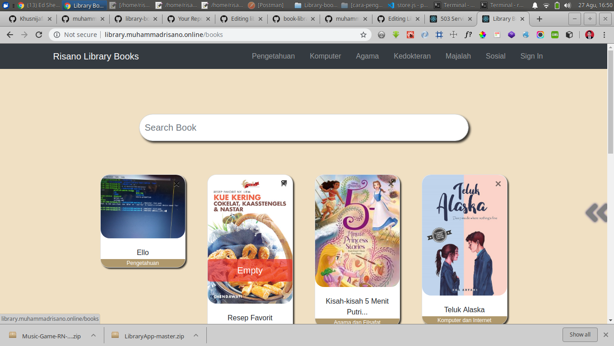
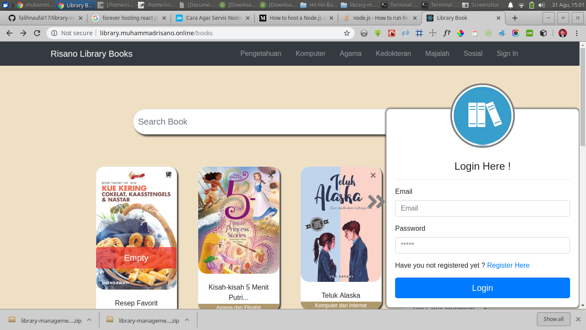
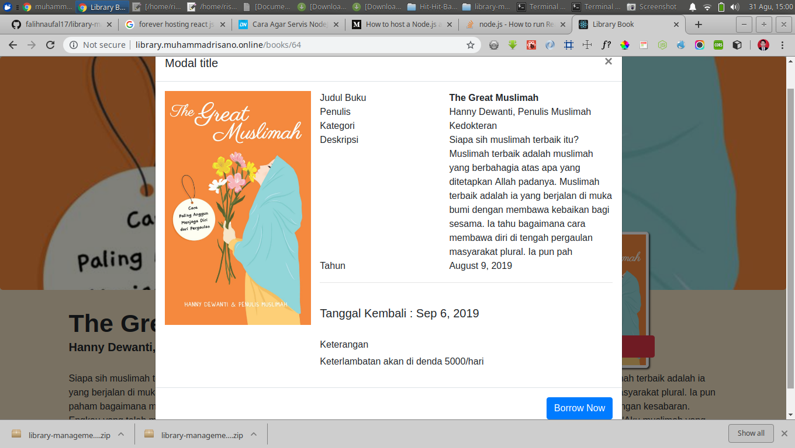
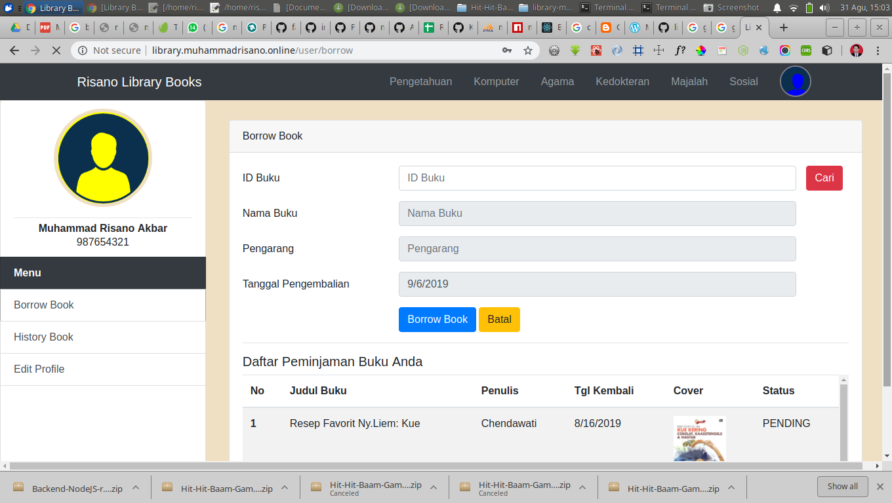
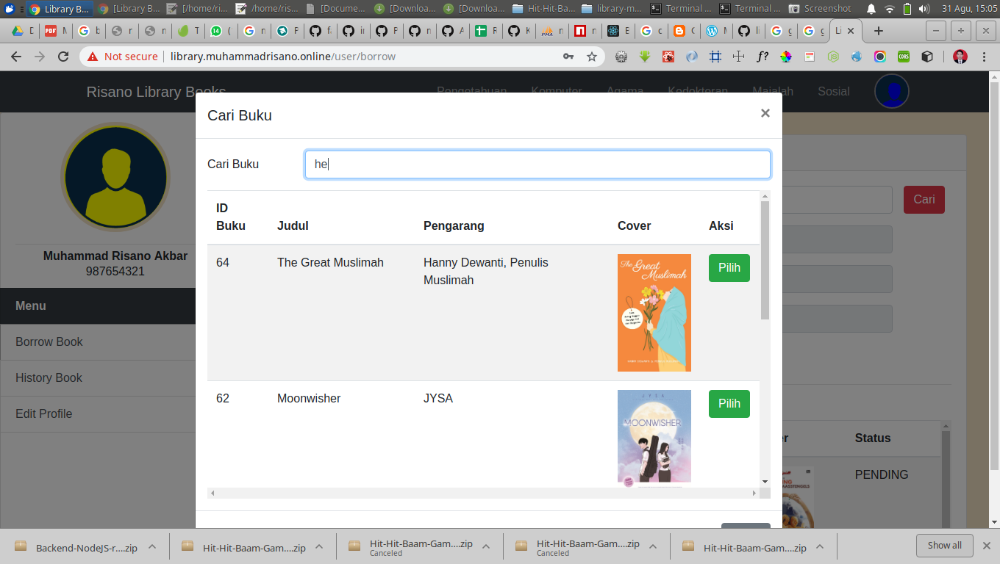
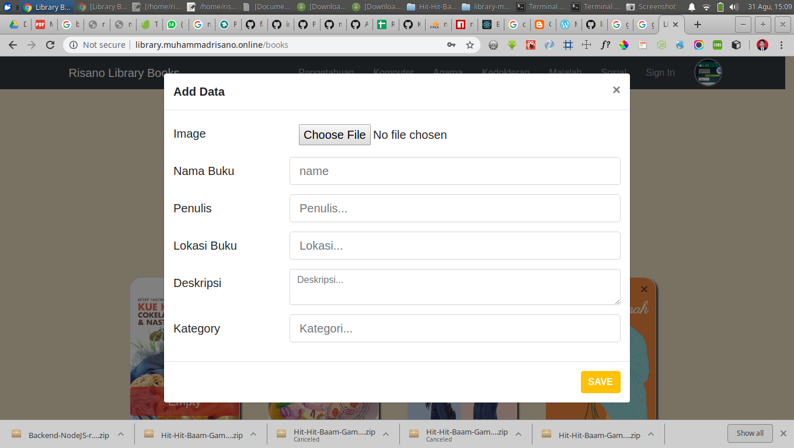
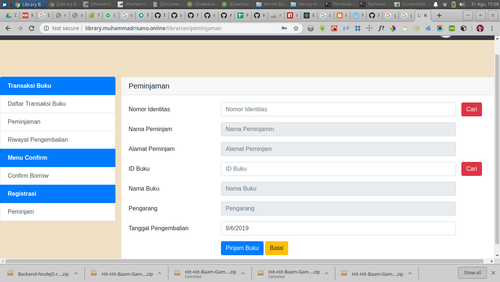

<h1 align="center">Risano Library Books</h1>

  Built With React Js
 

## Table of Contents

- [Introduction](#introduction)
- [Features](#features)
- [Requirements](#requirements)
- [Usage](#usage-for-development)
- [Screenshots](#screenshots)
- [Release Web](#release-apk)
- [Related Project](#related-project-backend)
- [Contributors](#contributors)

## Introduction
**Risano Library** Book is an online library website with roles as guests, customers and librarians

## Features
* guests can only see the books that are available
* Users can loan some books
* Users can see the loan history
* Users can loan some books
* Donate Book
* And others

## Requirements
* [`npm`](https://www.npmjs.com/get-npm)
* [`reactjs`](https://reactjs.org/docs/getting-started.html)
* [`Backend`](https://github.com/muhammadrisano/Library-book-backend-expressjs)

## Usage for development
1. Open your terminal or command prompt
2. prepare a Backend
3. Type `git clone https://github.com/muhammadrisano/library-book-frontend-reactjs.git`
4. Open the folder and type `npm install` for install dependencies
5. Type `npm start` for run this app.

## Screenshots

  
  
  
  
    
  

## Release Web
[Risano Library](http://library.muhammadrisano.online)

## Contributors

  <table>
    <tr>
      <td align="center">
        <a href="https://github.com/muhammadrisano/">
           
          <b>Muhammad Risano Akbar</b>
        </a>
      </td>
    </tr>
  </table>

